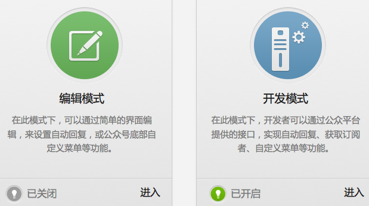

.. include:: ../LINKS.rst

那么
==============

即然已经获得了公众平台的权限, 那就要干点儿实事儿了!

.. _fig_0_3:

   插图 0-3 "开发模式"成功开启

则,要解决的子问题有:

    - 怎么获得 `POST` 来的数据?
    - 怎么对提交的数据进行合理解析?
    - 怎么合法的返回消息给好友? 
    - 怎么对请求方式进行判定?
    - ...

.. warning:: 

    - 还需继续折腾...

