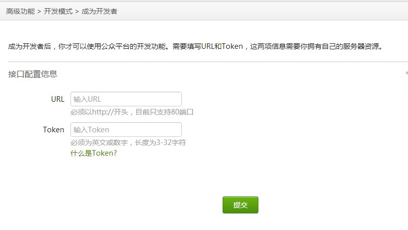

.. include:: ../LINKS.rst

00:00" 初尝
==============

整起来先!
- 嗯嗯嗯,现在可以计时了: `00:00`

安装
--------

`参考:` `dev_server`_ 官方安装说明

.. sidebar:: 提示

    - 不专门说明的话,指的都是笔者的个人环境:

      - MacOS X 10.7.3
      - `Python`_ 2.7.1

    - 不过,真心兼容所有 Linux 发行版环境的!
    - 另外在引用中文本中:
    - `$` 表示以普通用户,在命令行环境中的操作;
    - `#` 表示以`root`身份,在命令行环境中的操作;

安装SAE本地虚拟环境 ::

    $ git clone http://github.com/SAEPython/saepythondevguide.git
    $ sudo python setup.py install
    $ dev_server.py --help
    Usage: dev_server.py [options]

    Options:
      -h, --help            show this help message and exit
      -p PORT, --port=PORT  Which port to listen
      --mysql=MYSQL         Mysql configuration: user:password@host:port
      --storage-path=STORAGE
                            Directory used as local stoarge

同时也就拥有了SAE专用部署工具 `saecloud`_ ::

    $ saecloud version
    SAE command line v0.0.1
    $ saecloud -h
    usage: saecloud [-h] {version,export,deploy} ...

    positional arguments:
      {version,export,deploy}
                            sub commands
        export              export source code to local directory
        deploy              deploy source directory to SAE
        version             show version info

    optional arguments:
      -h, --help            show this help message and exit

创建
--------

先在 `SAE`_ 申请开发者帐号, 再创建个 `Python`_ 应用, 取个好名字,

比如 `wechat` ,嗯嗯嗯,目测是不可能了,,, 但是,我们的示例都将以此为名

验证
----------

那么开始 `SAE`_ 的应用编程吧!

理解 `SAE`_ 的应用目录结构::

    /path/2/you/wechat/
      +- config.yaml    应用配置
      +- index.wsgi     应用根代码

`config.yaml` ::

    ---
    name: wechat
    version: 1

`index.wsgi`

.. code-block:: python
    :linenos:
    :emphasize-lines: 2,3,6,8,9,13 

    # -*- coding:utf-8 -*-
    from bottle import *
    import sae

    APP = Bottle()
    application = sae.create_wsgi_app(APP)

    @APP.get('/echo')
    @APP.get('/echo/')
    def echo_wechat():
        print request.query.keys()
        print request.query.echostr
        return request.query.echostr

94这么简单!

然后,本地跑一下,看是否正常::

    $ dev_server.py
    MySQL config not found
     * Running on http://localhost:8080/
     * Restarting with reloader
    MySQL config not found

命令行见到这样输出的,就说明本地的 `SAE`_ 开发服务已经跑起了,代码本身已经没有问题了;
需要部署到云端,真正跟 `wechat`_ 配合起来才能测试业务,

所以::

    $ saecloud deploy
    Deploying http://wechat.sinaapp.com
    Updating cache
    Finding changes
    Deploying to server...  done

使用部署工具,向云端部署,如果出现以上类似的输出,就说明成功了,
否则,查相关文档了: `saecloud`_

等等?!
--------

这一大堆代码研究是作什么用的?!

嗯嗯嗯...

.. _fig_0_1:

   插图 0-1 成为微信公众平台开发者

因为,想从默认的 `编辑模式` 切换为高级的 `开发模式`

- `wechat`_ 首先要检验我们是否有开发能力
- 通过极其简单的一个 `RESTful`_ 接口注册
- `wechat`_ 将我们自个儿定义的一个 `Token` 经过加密发送到我们自个儿注册的接口
- 然后,如果我们在5秒之内部反馈回了正确的, `wechat`_ 发送过来的 `echostr` ~ 随机字符串 就证明,我们已经发布了一个同运行可应答的 web 服务,是头合格的程序猿!
- 就会立即开放 `开发模式` 给我们的公众号,提供进一步的自动服务

所以,经过上述的本地测试,部署,我们其实已经获得了一个

http://wechat.sinaapp.com 

接口服务网站!

- 只发布了唯一的接口 http://wechat.sinaapp.com/echo
- 功能就是接收 `wechat`_ 发送过来的 `网址接入 <http://mp.weixin.qq.com/wiki/index.php?title=%E6%B6%88%E6%81%AF%E6%8E%A5%E5%8F%A3%E6%8C%87%E5%8D%97#.E7.BD.91.E5.9D.80.E6.8E.A5.E5.85.A5>`_ 请求
- 并毫无验证的返回其中的 `echostr` ~ 随机字符串 

cURL
------------------

好的,有聪明的读者肯定已经观察出,不科学的地方!

- 这样一来, 难道每次都要 部署 `SAE`_ 再触发 `wechat`_ 来测试?!?!?!

嗯嗯嗯,严格的来说,肯定不用的,,,我们在本地有更加伟大的 `cURL`_

.. _fig_0_2:
.. figure:: ../_static/figs/chaos0-2-tmux.png

   插图 0-2 使用 tumx 收纳运行+测试 在同一界面

可以在本地,对 `SAE`_ sdk 测试环境中的运行网站,进行模拟访问来观察输出,明确是否达成了设想中的响应!

然后再部署上去.

7:01" 小结
------------------

不出意外的话, 七分钟 用在这个阶段,很足够了!

整体思路,就是要,先习惯,并建立起,依托 `SAE`_ 的开发过程:

::

      修订代码
      ^  `->saecloud deploy
      |       `-> curl 请求测试
      |               |
      +---------------/

