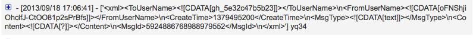
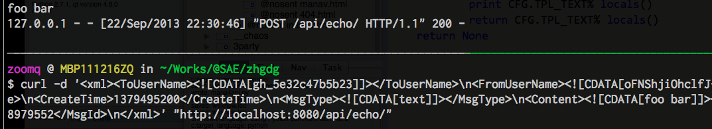
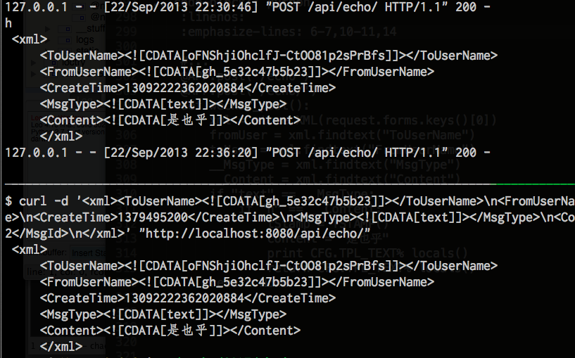
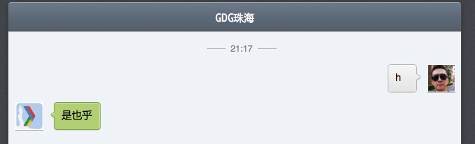

.. include:: ../LINKS.rst

7:42" 突入 
==============

嗯嗯嗯,现在可以开始计时了...

Bottle
---------------------------

首先,想长治久安式的维护服务,代码的物理分布一定要合理/模块化/易管理!

参考: `bottle做web开发的物理设计 | Vimer的程序世界 <http://www.vimer.cn/2011/12/bottle%E5%81%9Aweb%E5%BC%80%E5%8F%91%E7%9A%84%E7%89%A9%E7%90%86%E8%AE%BE%E8%AE%A1.html>`_

我们将原先看似简洁实际无结构的单文件结构::

    /path/2/you/wechat/
      +- config.yaml    应用配置
      +- index.wsgi     应用根代码

重构为有组织,有结构的工程::

    /path/2/you/wechat/
      +- config.yaml    应用配置
      +- config.py      全局配置
      +- index.wsgi     应用根
      +- module/        模块
      |     +-  utility.py          
      +- static/        静态文件
      |     +-  js/
      |     +-  css/
      |     +-  img/
      +- templates/     模板文件
      |     +-  base.html
      |     +-  404.html         
      |     +-  ...
      +- web/           应用代码
            +-  __init__.py
            +-  mana4cli.py
            `-  mana4api.py          

关键的运行时调用关系是这样的::

    index.wsgi
      -> import config.py
      -> from web import APP
        -> __init__.py mount api.py

.. sidebar:: 什么是框架?
    :subtitle: ~web应用框架

    - 首先, `Python`_ 世界中 `Web框架超级多! <http://wiki.python.org/moin/WebFrameworks>`_
    - 为毛? `Python Web应用框架纵论 <http://wiki.woodpecker.org.cn/moin/ObpLovelyPython/PCS304>`_ 有分析
    - 不过, 框架到底是什么? 和模块有什么区别?
    - `CPyUG`_ 的列表中争论过多次,最后的共识是: `框架是种可复用的设计构件!`  给人用的,包含丰富过往经验的,内置多种领域常见功能的,加速应用开发的专用模块集...
    - `Bottle`_ 是面向快速 web 应用开发的最轻型框架 ;-)

关键代码段,举例:

index.wsgi
^^^^^^^^^^^^^^^^^^^^^^^^^^^^^^^^^^^^^^^^^^^^^^^^^^^^^^^^^^^^^^^^^^^^

.. code-block:: python
    :linenos:
    :emphasize-lines: 2,3,5 

    # -*- coding: utf-8 -*-
    import sae
    import config
    from bottle import *
    from web import APP

    application = sae.create_wsgi_app(APP)

config.py
^^^^^^^^^^^^^^^^^^^^^^^^^^^^^^^^^^^^^^^^^^^^^^^^^^^^^^^^^^^^^^^^^^^^

.. code-block:: python
    :linenos:
    :emphasize-lines: 1,5-7,10,16,25

    # -*- coding: utf-8 -*-
    import sys
    import os.path

    app_root = os.path.dirname(__file__)
    sys.path.insert(0, os.path.join(app_root, "module/"))
    sys.path.insert(0, os.path.join(app_root, "web/"))

    class Borg():
        '''base http://blog.youxu.info/2010/04/29/borg
            - 单例式配置收集类
        '''
        __collective_mind = {}
        def __init__(self):
            self.__dict__ = self.__collective_mind
            
        TPL_TEXT=''' <xml>
         <ToUserName><![CDATA[%(toUser)s]]></ToUserName>
         <FromUserName><![CDATA[%(fromUser)s]]></FromUserName>
         <CreateTime>%(tStamp)s</CreateTime>
         <MsgType><![CDATA[text]]></MsgType>
         <Content><![CDATA[%(content)s]]></Content>
         </xml>'''

    CFG = Borg()

web/__init__.py
^^^^^^^^^^^^^^^^^^^^^^^^^^^^^^^^^^^^^^^^^^^^^^^^^^^^^^^^^^^^^^^^^^^^

.. code-block:: python
    :linenos:
    :emphasize-lines: 4-5,6-7,9-10,13

    # -*- coding: utf-8 -*-
    from bottle import *

    APP = Bottle()
    APP.mount('/api', __import__('mana4api').APP)

    @APP.error(404)
    def error404(error):
        return template('404.html')

    @APP.route('/favicon.ico')
    def favicon():
        abort(204)
    

web/mana4api.py
^^^^^^^^^^^^^^^^^^^^^^^^^^^^^^^^^^^^^^^^^^^^^^^^^^^^^^^^^^^^^^^^^^^^

.. code-block:: python
    :linenos:
    :emphasize-lines: 4,6,8-9

    # -*- coding: utf-8 -*-
    import sae
    from bottle import *
    from config import CFG
    #debug(True)
    APP = Bottle()

    @APP.get('/echo')
    @APP.get('/echo/')
    def echo_wechat():
        print request.query.keys()
        print request.query.echostr
        return request.query.echostr

这样,划分功能目录,以及使用标准的 `Python`_ 路径操作后,
我们可以简单的在 `web/__init__.py` 中简单的增补一行 `装配`(mount) 代码;
就可以安全的,不触及原先任何一行代码,就扩展出一堆接口响应来!

唯一要注意的是最终的请求 url:

- 从原先集成在 `index.wsgi` 中时,写成什么就是什么
- 变成,有一个统一前缀了:
  - `/echo`
  - 变成了 `/api/echo`
  - 即使路由写的依然是 `@APP.get('/echo')`

.. warning:: 

    故! 我们的微信公众号开发的接口配置,可能需要对应变更一下 `URL`

XML
---------------------------

根据 `消息接口指南`_ 的阐述:
`文本消息 <http://mp.weixin.qq.com/wiki/index.php?title=%E6%B6%88%E6%81%AF%E6%8E%A5%E5%8F%A3%E6%8C%87%E5%8D%97#.E6.96.87.E6.9C.AC.E6.B6.88.E6.81.AF>`_ 是形如以下的简单 `XML`_ 字串::

     <xml>
     <ToUserName><![CDATA[toUser]]></ToUserName>
     <FromUserName><![CDATA[fromUser]]></FromUserName> 
     <CreateTime>1348831860</CreateTime>
     <MsgType><![CDATA[text]]></MsgType>
     <Content><![CDATA[this is a test]]></Content>
     <MsgId>1234567890123456</MsgId>
     </xml>

而在 `Pythonic`_ 世界,处理 `XML`_ 的模块很多, 但是,经过多年的激烈竞争,
`ElementTree <http://effbot.org/zone/element-index.htm>`_ 成为公认最快也最好的;

从而被吸收到了官方内置模块中,成为 `xml.etree.ElementTree <http://docs.python.org/library/xml.etree.elementtree.html>`_

戳哈微信
^^^^^^^^^^^^^^^^^^^^^^^^^^^^^^^^^^^^^^^^^^^^^^^^^^^^^^^^^^^^^^^^^^^^
先给 `web/mana4api.py` 追加个路由响应

.. code-block:: python
    :linenos:
    :emphasize-lines: 4

    #...
    @APP.post('/echo')
    def wechat_post():
        print request.forms.keys()

- 探查一下, 微信如文档所述,究竟向我们的接口怎么提交的数据?!
- 部署好后, 使用手机或是网页端 `wechat`_ 向我们的公众号发送 `h` 消息
- 然后,就可以从 `SAE`_ 的后台日志中见到:

.. _fig_1_1:

    插图 1-1 SAE 后台调试日志的输出

嗯嗯嗯?! 直接将数据体 `POST` 过来了?! 没有任键的包装?!
那么,就直接将 `request.forms.keys()` 解析出来的数据键当成值来处理就好了!?

修订为
.. code-block:: python
    :linenos:
    :emphasize-lines: 4

    #...
    @APP.post('/echo')
    def wechat_post():
        print request.forms.keys()[0]

再戳! .. 哈! 果断如设想!

获得关键信息
^^^^^^^^^^^^^^^^^^^^^^^^^^^^^^^^^^^^^^^^^^^^^^^^^^^^^^^^^^^^^^^^^^^^
有了数据体,从中获得关键的用户发送消息就好,增补代码,这次可以本地测试了...

.. code-block:: python
    :linenos:
    :emphasize-lines: 4

    #...
    @APP.post('/echo')
    @APP.post('/echo/')
    def wechat_post():
        #print request.forms.keys()[0]
        xml = etree.XML(request.forms.keys()[0])
        print xml.findtext("Content")

.. _fig_1_2:

    插图 1-2 本地测试XML 解析

直接使用 `ElementTree <http://effbot.org/zone/element-index.htm>`_ 
中的 `findtext()` 函式,果然可以精确的提取指定的节点内容!

那么接下来就简单了!

针对预订命令自动应答
^^^^^^^^^^^^^^^^^^^^^^^^^^^^^^^^^^^^^^^^^^^^^^^^^^^^^^^^^^^^^^^^^^^^

简单检查消息类型,以及消息内容,先仅仅对 `h` 自动回答: `是也乎`

.. code-block:: python
    :linenos:
    :emphasize-lines: 6-7,10-11,14

    #...
    @APP.post('/echo')
    @APP.post('/echo/')
    def wechat_post():
        xml = etree.XML(request.forms.keys()[0])
        fromUser = xml.findtext("ToUserName")
        toUser = xml.findtext("FromUserName")
        __MsgType = xml.findtext("MsgType")
        __Content = xml.findtext("Content")
        if "text" == __MsgType:
            if "h" == __Content:
                tStamp = TSTAMP()
                content = "是也乎"
                print CFG.TPL_TEXT% locals()
                return CFG.TPL_TEXT% locals()
        return None 

.. _fig_1_3:

    插图 1-3 本地测试应答

通过 `cURL`_ 本地测试通过,然后部署到 `SAE`_

那么就应该得到:

.. _fig_1_4:

    插图 1-4 微信网页版应答测试

27:00" 小结
---------------------------

即,最终增补了 14 行代码,完成了我们 `wechat`_ 自动应答机的原型!!!

二十分钟,整出来不难吧? 因为,基本上没有涉及太多 `Bottle`_ 的特殊能力,

- 目测,都是力气活儿

  - 只要别抄錯
  - 都是赋值,赋值,赋值,赋值,,,,

- 只要注意每一步,随时都可以使用 `print` 吼回来,测试确认无误,就可以继续前进了,,,

`这就是脚本语言的直觉式开发调试体验!`

