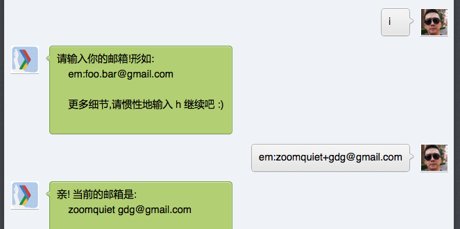

.. include:: ../LINKS.rst

27:42" 重构
============================

根据文档, `SAE`_ 目前的服务基本覆盖了所有Web应用所需要的功能，包括：

- MySQL （分布式数据库服务，通过RDC提供）
- Memcache （分布式缓存服务）
- Storage（分布式文件存储服务）
- KVDB（分布式key-value持久化存储）
- Cron（分布式定时服务）
- Image（分布式图像处理服务）
- FetchURL（分布式网页抓取服务）
- Mail（分布式邮件服务）
- TaskQueue（异步轻量级任务队列）
- DeferredJob（异步大任务延迟队列）
- Counter（分布式计数器服务）
- Rank（实时排行榜服务）
...

好吧, 我们只是想要一个可以在服务端存储成员邮箱的机制,
可以说,同唯一的 微信帐号一一对应的 `键-值` 数据而已;

目测就是 `KVDB`_ 而已了!

参考官方示例:

.. code-block:: python
    :linenos:
    :emphasize-lines: 1,2,4,8,10

    import sae.kvdb
    kv = sae.kvdb.KVClient()
    k = 'foo'
    kv.set(k, 2)
    kv.delete(k)

    kv.add(k, 3)
    kv.get(k)

    kv.replace(k, 4)
    kv.get(k)

    print kv.get_info()

太足够了!

设计
-----------------

根据微信公众 `消息接口指南`_ 中所言::

    用户OpenID对一个公众号是固定唯一的串 

- 那么,就直接使用成员的这一 `OpenID` 作为 `KVDB`_ 中的 `键`;
- 不过,目测 `0FNShjiOhc1fJ-Ct2O80p2sPrBf5` 这种 `OpenID` 太不规整,而且容量识破
- 所以,统一使用 `hashlib <http://docs.python.org/2/library/hashlib.html>`_ 加密一下
- 对应的值就可以根据我们的需要任意扩展了,反正基本是标准的 `Python`_ 字典数据类型,本身值是可嵌套包含多种数据的!

那么对应的命令就先定为: `i` ~ Info. , information 的头字母

本地测试
-----------------------------

`web/mana4api.py` 扩展为:

.. code-block:: python
    :linenos:
    :emphasize-lines: 1-2,17,18,20,34-39

    import sae.kvdb
    KV = sae.kvdb.KVClient()
    #...
    @APP.post('/echo')
    @APP.post('/echo/')
    def wechat_post():
        xml = etree.XML(request.forms.keys()[0])
        fromUser = xml.findtext("ToUserName")
        toUser = xml.findtext("FromUserName")
        __MsgType = xml.findtext("MsgType")
        __Content = xml.findtext("Content")
        tStamp = TSTAMP()
        if "text" == __MsgType:
            if "h" == __Content:
                content = "是也乎"
                return CFG.TPL_TEXT% locals()
            elif "i" == __Content:
                uid = hashlib.sha1(toUser).hexdigest()
                print uid
                usr = KV.get(uid)
                if None == usr:
                    # 首次应答,没有建立档案
                    pass
                else:
                    # 已经有档案
                    if "em" in usr.keys():
                        # 曾经记录过邮箱
                        content = "你的邮箱: %s"% usr['em']
                    else:
                        # 未记录过
                        content = "请输入你的邮箱如\nem:foo@bar.com"
                print CFG.TPL_TEXT% locals()
                return CFG.TPL_TEXT% locals()
            elif "em" in __Content.split(":"):
                uid = hashlib.sha1(toUser).hexdigest()
                usr = KV.get(uid)
                print __Content[3:]
                usr['em'] = __Content[3:]
                KV.replace(uid, usr)
                content = "你的邮箱: %s"% usr['em']
                print CFG.TPL_TEXT% locals()
                return CFG.TPL_TEXT% locals()

        return None 

一样的,本地使用 `cURL`_ 完成测试后部署到 `SAE`_

最终效果
-----------------------------

.. _fig_2_1:

   插图 2-1 简单的收集成员邮箱情景过程

如截屏所示...

**BaZINga**

42:01" 小结
---------------------------------

~ 这一处增强,纯粹是根据文档配合本地测试, 不到30行代码, 一刻鈡是可以折腾出来的!

- 但是,过程中的心理冲突,绝对不轻
- 比如,文档中未言明的各种细节, 是否重要? 怎么测试确认?
- 怎么设计 `print` 点输出的格式,以便从后台日志中明确的识别出?
- 等等,都需要补课,老实查阅文档,认真领悟,大胆尝试,建立靠谱的思路和反应,,,

不过,整体上,只要思路明确,方向正确,真心只是个轻松的过程而已,,,

