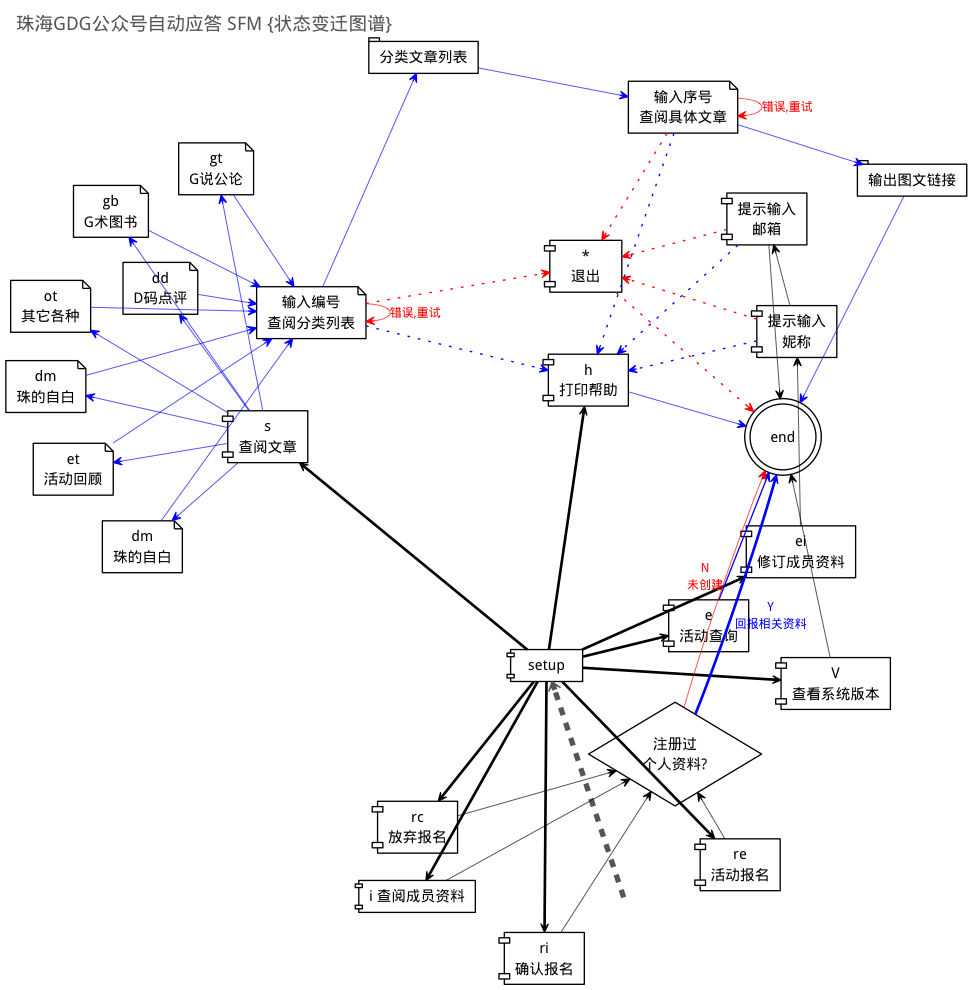

.. include:: ../LINKS.rst

整个儿的
==============

.. _fig_3_3:

   插图 3-3 最终使用前述各种知识点完成的 珠海GDG 公众号应答系统的 FSM 状态变迁图

代码仓库: `ZHGDG/zhgdg <https://github.com/ZHGDG/zhgdg/tree/wechat>`_

.. _fig_zhgdg:

   插图 珠海GDG 公众号

扫描或是搜索: ``GDG-ZhuHai``

各种坑的解释
---------------------------------

乱码,永远的乱码!
^^^^^^^^^^^^^^^^^^^^^^^^^^^^^^^^^^^^^^^^^^^^^^^^^^^^^^^^^^^^^^^^^^^^

为毛使用 ``fix/p/:TAG`` 增补后, 分类就无法输出文章列表了?! `SAE`_ 端日志表明::

     - Traceback (most recent call last):
      File "/data1/www/htdocs/466/weknow/3/bottle.py", line 764, in _handle
        return route.call(**args)
      File "/data1/www/htdocs/466/weknow/3/bottle.py", line 1575, in wrapper
        rv = callback(*a, **ka)
      File "/data1/www/htdocs/466/weknow/3/web/mana4api.py", line 509, in wechat_post
        return weknow.send2(wxreq.Content.strip(), wxreq)
      File "/data1/www/htdocs/466/weknow/3/3party/pyfsm.py", line 318, in send2
        return self.start2(trans ,obj)
      File "/data1/www/htdocs/466/weknow/3/3party/pyfsm.py", line 284, in start2
        return self.current_state.enter2(self, obj)
      File "/data1/www/htdocs/466/weknow/3/3party/pyfsm.py", line 444, in enter2
        return self.func(task, obj)
      File "/data1/www/htdocs/466/weknow/3/web/mana4api.py", line 758, in papers
        p_list = "    ".join(["%s: %s\n"%(p[0], p[1]) for p in papers4tag])
    UnicodeDecodeError: 'ascii' codec can't decode byte 0xe5 in position 9: ordinal not in range(128)

相关的问答: [python - How do I check if a string is unicode or ascii? - Stack Overflow](http://stackoverflow.com/questions/4987327/how-do-i-check-if-a-string-is-unicode-or-ascii)

在怀疑处打印字串的类型:

::

    Google平面设计指南
    <type 'str'>
    写给女儿高中编程课老师的一封信
    <type 'unicode'>

- 嚓! 原来因为批量导入时,从本地的 ``.json`` 文件上传的数据
- 和通过 `CLI`_ 工具远程增补的条目信息
- 记录到 `KVDB`_ 中的数据格式不同!

只有追加个特例完成处理...

